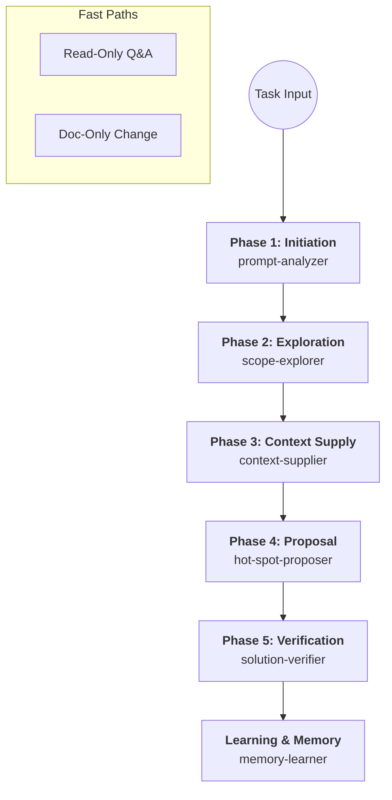

# 🌀 SDD Orchestration Flow

The **Smart Development Dashboard (SDD)** orchestration system follows a strict, evidence-based pipeline. Every non-trivial task must pass through these phases to ensure architectural integrity and minimize regressions.

## 🗺️ The Pipeline (The 5-Phase Flow)

### 1. Initiation (p3-ia-analyzer)
- **Tool**: `.agents/skills/p3-ia-analyzer/`
- **Output**: User Clue Inventory, Success Criteria, Scope Normalization.
- **Goal**: Establish clarity before any exploration. If clues are missing (logs, paths), STOP and ask.

### 2. Exploration (p3-ia-explorer)
- **Tool**: `.agents/skills/p3-ia-explorer/`
- **Output**: Asset Map, Logic Density Check, Evidence Traceability.
- **Goal**: Locate all affected files and identify "Complex" components (>900 lines) that require decomposition.

### 3. Context Supply (p3-ia-supplier)
- **Tool**: `.agents/skills/p3-ia-supplier/`
- **Output**: Filtered Context Package, Technical Debt Alerts.
- **Goal**: Provide only the necessary rules and patterns to minimize token usage and focus on the current task type (Bug vs Feature).

### 4. Proposal (p3-ia-proposer)
- **Tool**: `.agents/skills/p3-ia-proposer/`
- **Output**: Implementation Plan with Mandatory Hot Spots.
- **Goal**: Identify critical decisions (Hot Spots) and force a user A/B choice before implementation.

### 5. Verification (p3-ia-verifier)
- **Tool**: `.agents/skills/p3-ia-verifier/`
- **Output**: Solution Memory, Clue High-Signal Report.
- **Goal**: Run tests, validate against success criteria, and extract lessons learned into `p3-ia-learner`.

---

## 🤖 Agent Roles & Responsibilities

| Agent | Role | Responsibility |
| :--- | :--- | :--- |
| **sdd_agent** | **Orchestrator** | Drives the 5-phase flow. NEVER implements code directly. |
| **ask** | **Navigator** | Handles explanations and "Where is...?" questions. |
| **documentador** | **Writer** | Updates knowledge artifacts and `.agents/` docs. |
| **reviewer** | **Auditor** | Performs PR reviews and post-implementation verification. |
| **supplier** | **Librarian** | Fetches and packages the right documentation delta. |
| **explore** | **Scout** | Performs deep file searches and logic analysis. |

## 🔄 Dependency Flow
The orchestrator uses the `task` tool to delegate specific phases to sub-agents. 
- `sdd_agent` ➔ `task(Explore)` ➔ `task(Supplier)` ➔ `task(Reviewer)`.

## 🚦 Operational Mandates
- **Clue-First**: No phase begins without validating the "User Clue Inventory".
- **Consensus Gate**: Verification only starts after explicit user confirmation that the solution is stable.
- **Memory Loop**: Every successful fix MUST generate a `session-memory.md` to feed the system's learning.

