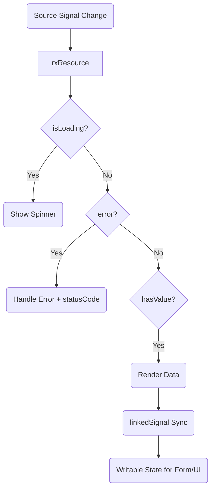

# Angular Reactivity — Decision Guide

> Sub-files: [resource-api.md](resource-api.md) | [testing.md](testing.md)

## 🔄 Resource Lifecycle

## 🧠 Choosing the Right Primitive

1. **React to signal changes?** No → regular function
2. **Read-only derived value?** Yes → `computed()`
3. **Writable signal that resets with a source?** Yes → `linkedSignal()`
4. **Async operation (HTTP)?** Yes → `rxResource()` · No → `effect()`

## 📝 Tool Summary

| Tool | Use Case | Output |
|:--|:--|:--|
| **Regular Function** | Logic without reactive flow | Static value |
| **computed()** | Derive read-only value from signals | Signal (Readonly) |
| **linkedSignal()** | Writable signal that resets with source | Signal (Writable) |
| **rxResource()** | Project-standard async HTTP operations with Signals | Resource Signal |
| **effect()** | Side effects (logging, DOM, external APIs) | Side Effect |
